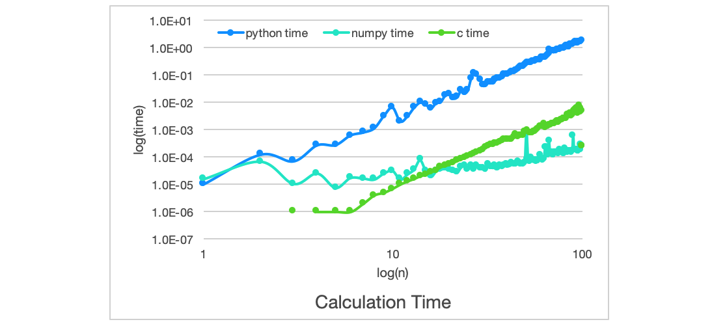
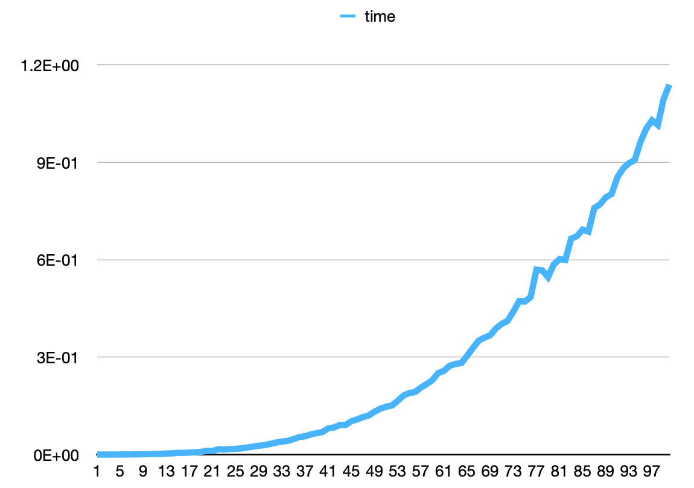
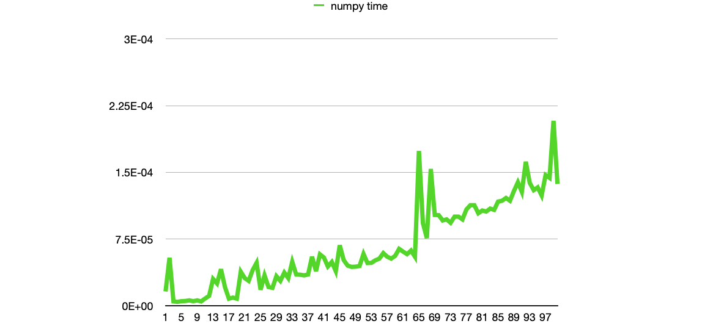

# Week2 Homework

## Homework1

* PythonコードのオーダーはO(N^3).
* numpy(ソースコードはC言語)で計算した方が、Pythonのコードとは比較できないくらい早かった

## Homework2
### Question
木構造はO(log N), ハッシュテーブルであればO(1)で検索、追加、削除を実現することができ、\
これだけ見ると、ハッシュテーブルの方が優れているように見える. \
ところが実際の大規模なデータベースではハッシュテーブルではなく、木構造が使われることが多い．\
それはなぜか？

### Answer
1. ハッシュテーブルはメモリを多く使うから.
* ハッシュテーブルは、ハッシュ値の分もメモリが必要なので、データベースが大規模になればなるほど、その量は膨大になる
N人のusernameとpasswardのデータベースなら、ほんとに必要なのは、2Nのメモリなのに、(衝突を考えなくても、)メモリが3N必要になる．
* ハッシュテーブルはその特性上、データベースには存在しないハッシュ値に対してもメモリを使う

2. ハッシュテーブルはNが大きくなるとどんどん性能が下がってしまうから.
* ユーザーが増えると衝突が起こりやすくなり、何もしないと性能がどんどん下がってしまう
→ 性能を戻すためには、一回サービスを停止させて、ハッシュ関数を変えて、ハッシュ値を全ユーザー分計算しなおさないといけない

## Homework3
### Question
ブラウザのキャッシュの管理をほぼO(1)で実現できるデータ構造を考える \
目標:「もっとも直近にアクセスされた上位X個の[URL, Webページ]の組が保存できるデータ構造」を作る
* 与えられた[URL, Webページ]があるかないかを検索
* もしない場合、キャッシュ内で一番古い[URL, Webページ]を捨てて、かわりに与えられた[URL, Webページ]を追加
* もしある場合、キャッシュの中にある[URL, Webページ]を一番新しい要素の位置に移動

### Answer

## Homework4
Homework3の実装をしてみる.
